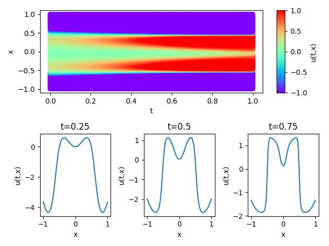

# Allen-Cahn-MindSpore

## 概述

计算流体动力学是21世纪流体力学领域最重要的技术之一。通过数值方法求解流体力学控制方程，可以实现流动分析、预测和控制。传统的有限元法（FEM）和有限差分法（FDM）由于仿真过程复杂（物理建模、网格划分、数值离散、迭代求解等）且计算成本较高，效率低下。因此，有必要利用人工智能来提高流体模拟的效率。

近年来，在经典理论和具有计算机性能的数值方法发展趋于平稳的同时，机器学习方法将大量数据与神经网络相结合，实现了流场的快速模拟。这些方法可以获得接近传统方法的精度，为流场求解提供了新的思路。

Allen-Cahn方程（以John W.Cahn和Sam Allen命名）是数学物理的反应扩散方程，描述了多组分合金系统中的相分离过程，包括有序-无序转变。该方程描述了域$`\Omega`$上标量值状态变量$`\eta`$在时间间隔$`T`$内的时间演化。本实验中，MindFLow流体模拟套件用于基于物理驱动的PINNs（Physics INformed Neural Networks）方法求解Allen Cahn方程。

## 问题描述

Allen Cahn方程的形式如下：
```math
\frac{\partial u}{\partial t} = \frac{\partial^2 u}{\partial x^2} + 5(u - u^3), x\in [-1, 1], t \in [0, 1]
```
本实验使用狄利克雷边界条件和初始条件，形式如下
```math
\begin{aligned}
u(-1, t)&=u(1, t)=-1 \\
u(x, 0)&=x^2cos(\pi x)
\end{aligned}
```
本实验利用PINNs方法学习位置和时间到相应物理量的映射(x,t)$`\to$u(𝑥,𝑡)`$\to`$𝑢，实现Allen Cahn方程的求解。

## 快速开始

### 环境安装

环境要求（MindSpore和MindFlow版本要对应）

- MindSpore >= 2.0.0

- MindFlow >=0.1.0 

本实验使用的是mindspore==2.0.0rc1，mindflow==0.1.0rc1

- 可参考[MindSpore](https://www.mindspore.cn/install)快速安装
- 可下载[mindspore.whl](https://ms-release.obs.cn-north-4.myhuaweicloud.com/2.0.0rc1/MindSpore/unified/x86_64/mindspore-2.0.0rc1-cp39-cp39-linux_x86_64.whl)、[mindflow.whi](https://ms-release.obs.cn-north-4.myhuaweicloud.com/2.0.0rc1/MindScience/gpu/x86_64/cuda-11.1/mindflow_gpu-0.1.0rc1-py3-none-any.whl)之后使用pip安装

### 代码准备

```
git clone https://github.com/ysysys666/Allen-Cahn-MindSpore.git
```

### 数据准备

从[dataset](https://download-mindspore.osinfra.cn/mindscience/mindflow/dataset/applications/research/allen_cahn/) 中下载验证所需要的数据集，并保存在`./dataset`目录下。

### 训练方式一

```
python train.py --mode GRAPH --device_target GPU --device_id 0 --config_file_path ./configs/allen_cahn_cfg.yaml
```

其中， `--mode`表示运行的模式，'GRAPH'表示静态图模式, 'PYNATIVE'表示动态图模式，详见[MindSpore官网](https://gitee.com/link?target=https%3A%2F%2Fwww.mindspore.cn%2Fdocs%2Fzh-CN%2Fr2.0.0-alpha%2Fdesign%2Fdynamic_graph_and_static_graph.html%3Fhighlight%3Dpynative)，默认值'GRAPH'；

`--device_target`表示使用的计算平台类型，可以选择'Ascend'或'GPU'，默认值'Ascend'；

`--device_id`表示使用的计算卡编号，可按照实际情况填写，默认值0；

`--config_file_path`表示参数文件的路径，默认值'./configs/allen_cahn_cfg.yaml'；

### 训练方式二

可以使用Jupyter Notebook逐行运行训练和验证代码。

### 验证

```
python test.py
```

要验证的checkpoint需要在config_file中指定，本实验默认是最后的[checkpoint](./ckpt/ac-15001.ckpt)，结果默认保存在images文件夹

### 结果展示

